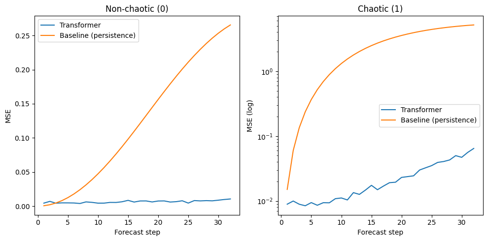
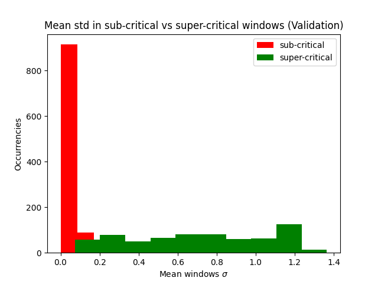
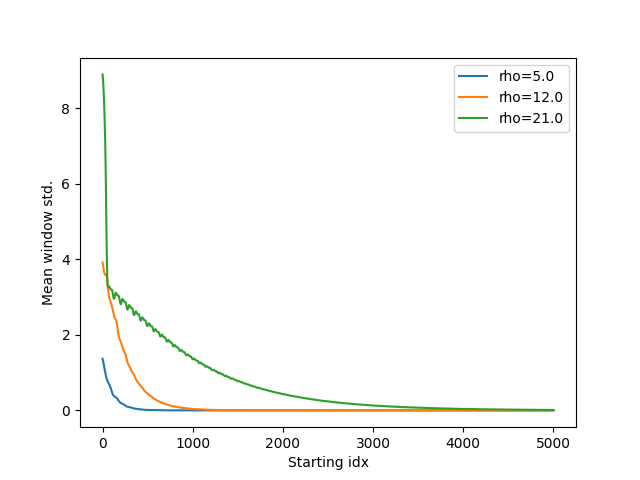
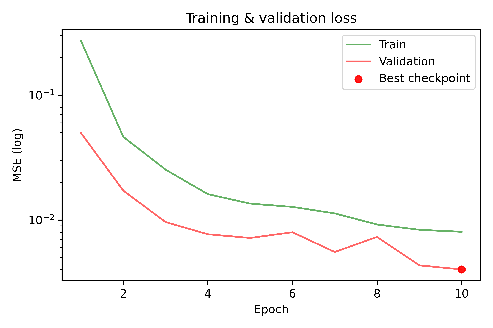

# Multi-Step Forecasting on Lorenz-63 with Transformer model

Multi-step forecasting of nonlinear dynamical systems across chaotic and non-chaotic regimes.


<sub>
The forecast shown above is generated using an autoregressive rollout.  
Starting from a fixed input window, the model predicts the next step, which is then fed back as input to iteratively generate a longer trajectory.  
This allows evaluation beyond the fixed training horizon while preserving maximum short-term accuracy at each step.  
The divergence observed at later times is therefore a consequence of intrinsic chaotic sensitivity, not a single-shot long-horizon prediction artifact.
</sub>

---

Predicting the future of a nonlinear system is fundamentally different depending on whether the system is stable or chaotic.  
In chaotic regimes, trajectories **diverge exponentially from infinitesimal perturbations**.  
This project investigates how a Transformer behaves under these fundamentally different dynamical conditions.

---

# What this project does

This repository explores **multi-step forecasting** on the Lorenz-63 system:

- Input: a window of past states   
- Output: a multi-step forecast of future states  
- Comparison across:
  - Sub-critical (stable) regime ($\rho < \rho_c$) 
  - Super-critical (chaotic) regime ($\rho > \rho_c$)  

The central question:

> Can a Transformer learn meaningful multi-step dynamics in a chaotic system, where predictability is intrinsically limited?

---

# Key Results



The central metric used to evaluate forecasting performance is the mean squared error (*MSE*) as a function of the forecast horizon. Instead of reporting a single aggregated number, the error is analyzed step-by-step, which makes it possible to observe how predictive accuracy degrades over time and how this degradation depends on the dynamical regime.

In the **sub-critical** (non-chaotic) **regime**, the error remains almost constant across the forecast horizon. This behavior reflects the intrinsic stability of the system: **trajectories tend to converge toward stable attractors**, and small prediction errors do not amplify significantly over time. In this regime, the Transformer maintains accurate multi-step forecasts well beyond the immediate horizon.

In the **super-critical** (chaotic) **regime**, the behavior is qualitatively different. The prediction error increases with forecast step, as expected for a system exhibiting sensitive dependence on initial conditions. However, the growth is structured rather than random: the Transformer consistently outperforms the persistence baseline, and **the predicted trajectories remain confined to the attractor manifold** even when diverging from the exact ground truth trajectory.

The persistence baseline, which simply repeats the last observed state across the forecast horizon, provides a lower bound on trivial continuation. The Transformer surpasses this baseline in both regimes, demonstrating that it learns meaningful short-term dynamics rather than exploiting superficial statistical correlations.

Overall, the results show that the model captures the local flow of the system effectively, while the long-horizon degradation observed in the chaotic regime reflects **intrinsic limits of predictability** rather than model instability.

---

# Why forecasting? (And why not just classification)

The project initially included two auxiliary tasks: regime classification (sub-critical vs super-critical) and regression of the control parameter ρ. These tasks were implemented to evaluate whether complex sequence models were necessary to extract meaningful information from the trajectories.

A straightforward analysis of the dataset, however, revealed that **regime separation is structurally simple**. Even basic window-level statistics, such as the standard deviation of the trajectory within a window, are sufficient to almost perfectly separate the two regimes.



In practice, a lightweight CNN1D architecture already achieves high performance on these tasks (regime classification and rho regression), confirming that they are not dynamically demanding.

*(CNN1D metrics image)*

Forecasting, on the other hand, is fundamentally different. It requires modeling the temporal evolution of the system and capturing its local flow in state space. Unlike classification, which can rely on static distributional differences, **multi-step prediction forces the model to learn how the state transforms over time**.

> For this reason, the focus of the project was shifted from regime/ρ detection to multi-step forecasting, which constitutes the physically meaningful and dynamically non-trivial problem.

---

# Dataset & Sampling Strategy

The dataset is generated from simulated Lorenz-63 trajectories by varying the control parameter *ρ* across sub-critical and super-critical regimes. Long trajectories are segmented into fixed-length sliding windows and split into train, validation, and test sets.

Each window is defined as:

- Input length: `T_in = 128`
- Forecast horizon: `H = 32`

The model therefore receives a 128-step history and predicts the subsequent 32 time steps.

A central issue in dynamical systems datasets is the presence of *dead windows*: segments where the trajectory has already collapsed onto the attractor and exhibits very low local variability. Such windows are statistically redundant and can artificially simplify forecasting, especially in sub-critical regimes where convergence to equilibrium is rapid.

To address this, I performed a systematic analysis of window-wise standard deviation as a function of the starting index along each trajectory. This analysis revealed that the early portion of trajectories contains meaningful transient dynamics, while later segments increasingly collapse toward steady attractor behavior.

<p align="center">
  
</p>

Based on this empirical inspection, the following sampling bounds were selected:

- `burn_in ≈ 400`
- `stop_idx ≈ 2000`

These values ensure that windows are extracted from dynamically informative regions while avoiding trivial steady-state segments.

Even simple statistics such as window variance largely separate the two regimes, which explains why classification tasks are comparatively simple.

After applying the selected burn-in and sampling bounds, the fraction of dead windows in each dataset split is:

| Split       | Dead Windows Fraction |
|------------|-----------------------|
| Train      | 0.513                 |
| Validation | 0.534                 |
| Test       | 0.511                 |

These values indicate that approximately half of the windows still lie in low-variance attractor regions, but the sampling procedure prevents the dataset from being dominated by trivial steady states.

---

# Model

The forecasting task is modeled using a Transformer encoder architecture designed to learn the local flow of the Lorenz-63 system from fixed-length trajectory windows. 

Each input window consists of 128 consecutive 3D states $(x, y, z)$. These are first projected into a higher-dimensional embedding space, where temporal structure can be modeled via self-attention. Positional encoding is added to preserve ordering information, ensuring that the model distinguishes early from late states within the input window.

The Transformer encoder stack then processes the embedded sequence, allowing the model to learn temporal dependencies across the entire history window. The final hidden representation is mapped to a 32-step future trajectory through a linear forecasting head.

### Architecture Details

- Input dimension: 3 (state space coordinates)
- Input length: `T_in = 128`
- Forecast horizon: `H = 32`
- Model dimension: `d_model = 128`
- Number of encoder layers: `n_layers = 4`
- Number of attention heads: `n_heads = 4`
- Feedforward dimension: `d_ff = 512`
- Dropout: `dropout = 0.1`

The model predicts the entire 32-step horizon in a single forward pass during training. For visualization beyond the fixed horizon, an autoregressive rollout is used, where predictions are recursively fed back as input.

### Loss and Optimization

The model is trained using Mean Squared Error (*MSE*) computed over the full forecast horizon:

$$\mathcal{L} = \frac{1}{H} \sum_{t=1}^{H} \| \hat{x}_{t} - x_{t} \|^2$$

Training includes:

- Early stopping based on validation loss
- Best checkpoint selection
- Standardization using training-set statistics only

The log-scale training and validation curves show stable convergence without divergence or overfitting:

<p align="center">
  
</p>

### Interpretation

The Transformer is not used here as a black-box predictor. Its role is to approximate the local dynamical flow map:

$$\Phi_{H}: x_{t-T:t} \mapsto x_{t+1:t+H}$$

In the non-chaotic regime, this mapping is stable and well-behaved.  
In the chaotic regime, the mapping is locally accurate but globally unstable due to intrinsic sensitivity to initial conditions.

The model therefore captures short-term dynamics effectively, while **long-horizon degradation reflects structural properties of the system** rather than architectural failure.

---

## Reproducibility

All experiments, training procedures, and visualizations are fully reproducible from the repository.

### Installation

Clone the repository and install dependencies:

```bash
git clone https://github.com/flaviogeuforbio/lorenz63-forecast-transformer
cd lorenz63-forecast-transformer
pip install -r requirements.txt
```

### Training

To train the Transformer model:

```
python src/train.py --help
```

### Forecast Evaluation & Plots

To generate forecasting performance plots (MSE vs horizon):
```
python src/make_mseplots.py --help
```

To generate training curves:
```
python src/make_losscurves.py --help
```

To generate the 3D forecast animation:
```
python src/make_animations.py --help
```


### Dataset Analysis
To reproduce dataset diagnostics (dead windows analysis, regime separability)

```
python src/make_mseplots.py --help
```

---

## Limitations & Future Directions

This project focuses on deterministic multi-step forecasting of Lorenz-63 trajectories under controlled simulation settings. While the results are structurally consistent with dynamical system theory, several limitations remain.

First, **no explicit estimate of the Lyapunov time** or predictability horizon is computed. The error growth observed in the chaotic regime is qualitatively consistent with exponential divergence, but it is not quantitatively linked to the system’s Lyapunov exponents.

Second, **forecasting is purely deterministic**. The model produces point estimates without uncertainty quantification, which is particularly relevant in chaotic systems where long-term prediction becomes fundamentally probabilistic.

Third, **experiments are conducted on a single canonical system** (Lorenz-63). Although useful as a benchmark for nonlinear dynamics, broader validation across different dynamical systems would strengthen generality claims.

Potential extensions include:

- Estimating Lyapunov exponents and relating them to forecast error growth
- Incorporating probabilistic forecasting (e.g., predictive distributions)
- Comparing with alternative sequence models (e.g., Neural ODEs, state-space models)
- Introducing physics-informed constraints into the loss function

These directions would allow a deeper investigation of how sequence models interact with intrinsic dynamical instability, moving from empirical forecasting toward a more theory-aware modeling framework.

